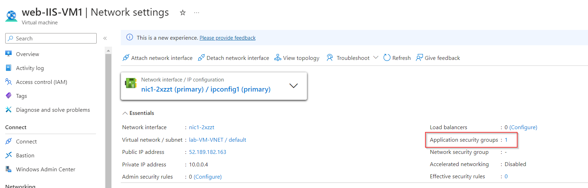

# Create an Application Security Group for Two Web Servers in Azure

**There are 3 objectives with this lab:**
* Create a New Application Security Group
* Create a New Network Security Rule
* Test Connectivity to the Web Servers

## Create a New Application Security Group

For our first objective, lets go into the search bar and look for `Application Security Group`. 

At the top of this screen, we'll click `+ Create` to make a new Application Security Group (ASG).

We'll choose out resource group (RG) and then give our ASG the name `asgWebServers`. Click create to finish the process. 

That conlcudes this portion of the lab! On to the next. 

## Create a New Network Security Rule

Now lets search for our Network Security Group (NSG) by using the search bar at the top of the portal. 

Select the pre-made NSG named `lab-VM-NSG`.

Now, we're going to create a new rule. On the left, navigate to Settings > Inbound security rules. Click `+ Add` at the top of this page. The new rule settings should pop up on the right side of the screen. We're going to change the Destination to `Application security group` and choose our newly created ASG. The destination ports will be HTTP and HTTPS. We gave the rule a priority of 124 which is right below the RDP rule that was pre-configured. Lastly, we gave the rule the name `WebServers_Rule` and clicked Create. 

We can see the newly created rule in the inbound rule set after the page refreshes. 

Now, we need to attach this ASG to the NICs of the two VMs in this lab. Lets navigate to the first VM labeled `web-IIS-VM1`. Find Networking > Network settings in the left panel. To the right of this page, you'l see Application security groups and 0 groups configured. Click on configure and it will take us to a new page. 

On this next page, clicked on `+ Add application security groups` and a panel on the right side of the screen should open up. Click on the checkbox of the ASG we created earlier and save your configurations. 

Once you navigate back to the network settings of the VM, your ASG settings should have been updated to say 1. 

Do the same exact process for VM2 and you should get the same result. 

That finishes up this section of the lab. Now, we need to test to see if the ASG worked. 

## Test Connectivity to the Web Servers

For the final part of the lab, lets grab the Public IP (PIP) of each IIS-VM and used HTTP in our web browser to make sure each page appears. 

After putting that PIP in to the web browser, you should reach the IIS splash page. 

Here's the splash page for VM2

That should suffice. Lab completed!

## Personal Notes

This lab was pretty straightforward. I hate to admit it but I don't necessarily remember the purpose of this ASG. I'm pretty used to creating FW rules so that part was really easy. Another lab completed!
